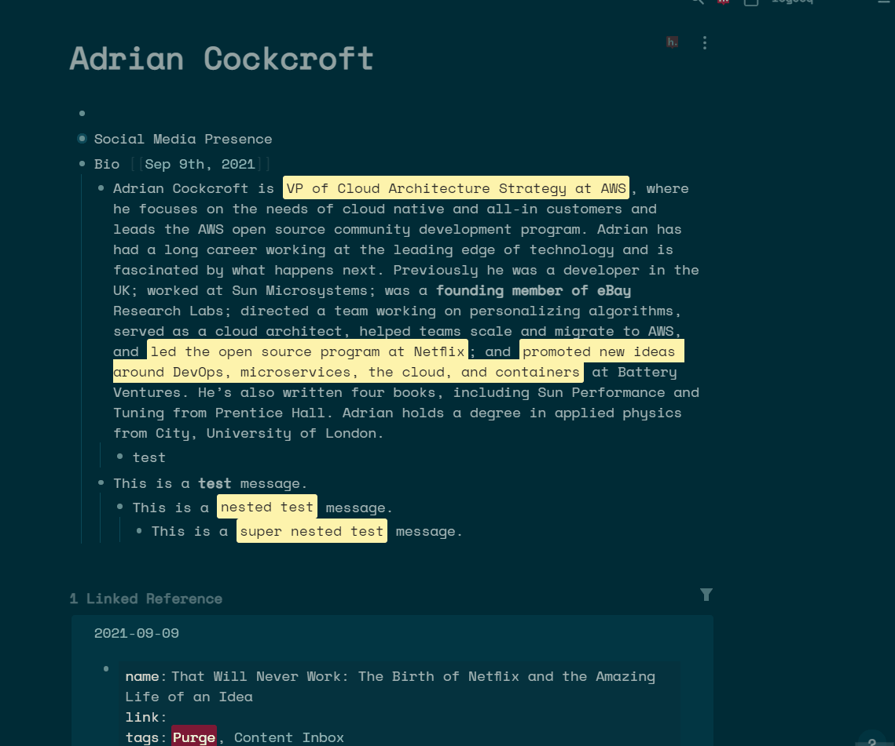
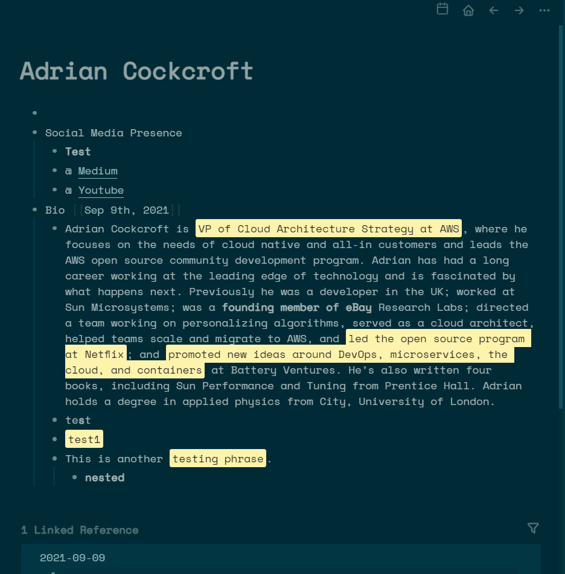

# logseq-extract-plugin
A fork of the [logseq extract plugin](https://github.com/sidharth-panwar/logseq-extract-plugin) by @sidharth-panwar
The logseq-extract-plugin is used to extract bold and highlighted text from a block and all its nested blocks or the complete page.

Here's how it looks like:

### Extract Block

### Extract Page

The plugin relies on regex to match and extract the desired text. So, technically, you can change the match settings and extract custom text as well, for e.g., if you mark certain points in your text with a special character like $$ etc., you can update the regex settings and the plugin will extract this new text for you.

## Settings Overview
Here's an overview of some of the settings:
- expr: This holds the regex that is used to extract the text. By default, it supports bold and highlight. **ONLY CHANGE THIS IF YOU KNOW WHAT YOU'RE DOING!**
- summaryTitle: This holds the text for the extract parent block. Default is 'Summary'.
- keepRefs: This setting when true keeps a reference to the source block in this format [*](((uuid))). Default is true.
- nested: This setting when true extracts from current block and all the nested blocks. Default is true.
- keepSummaryAbove: This setting decides where the summary will be created. It's a boolean setting and is set to false by default. When the setting is true for a block the summary block is created immediately above the block. If the setting is true and we do a page level extract then Summary becomes the first block of the page. If false (default), summary is created either immediately below a block or at the bottom of the page.
- keepMeta: Remove highlights and bold from extracted text. Default is false. If set to true it'll keep the bold and highlights with the extracted text.
- settingsVersion: **DON'T CHANGE THIS. THIS IS ONLY FOR THE PLUGIN TO UPDATE!**

Whenever changing the settings, you'll need to restart logseq for settings to take effect.

## Running the Plugin

- Download the release

## Dev Considerations
Steps to build the plugin:
- Enable Dev Mode in Logseq to test the plugin
- Push commits to Github
- Update the tag locally by using this command: `git tag <version>`
- Push the tag to trigger a Github action: `git push --tags origin`
